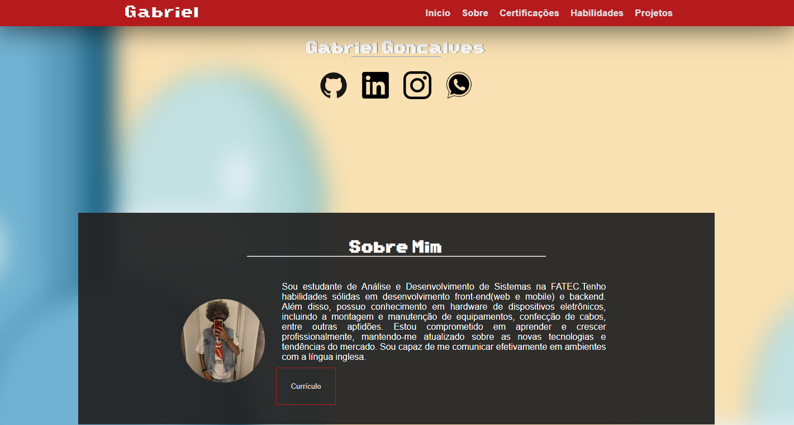

# Pagina de apresentação pessoal - Temático do Mario

Este projeto foi desenvolvido como parte da disciplina de Programação para a Web (PWEB), ministrada pela professora Denilse. O objetivo do projeto foi aplicar os conceitos e técnicas aprendidas durante o curso, além de demonstrar habilidades em HTML5 e CSS3.
Espero que você aprecie o projeto e possa conhecer um pouco mais sobre meu trabalho por meio desta divertida temática.

Para acessar o site clique <a href="https://portifolio-gabrielgoncalves.netlify.app/">aqui</a>.

# Tecnologias Utilizadas

HTML5

CSS3

Javascript

